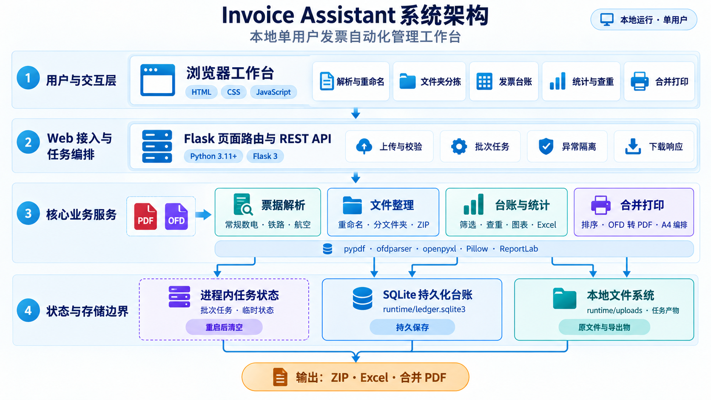
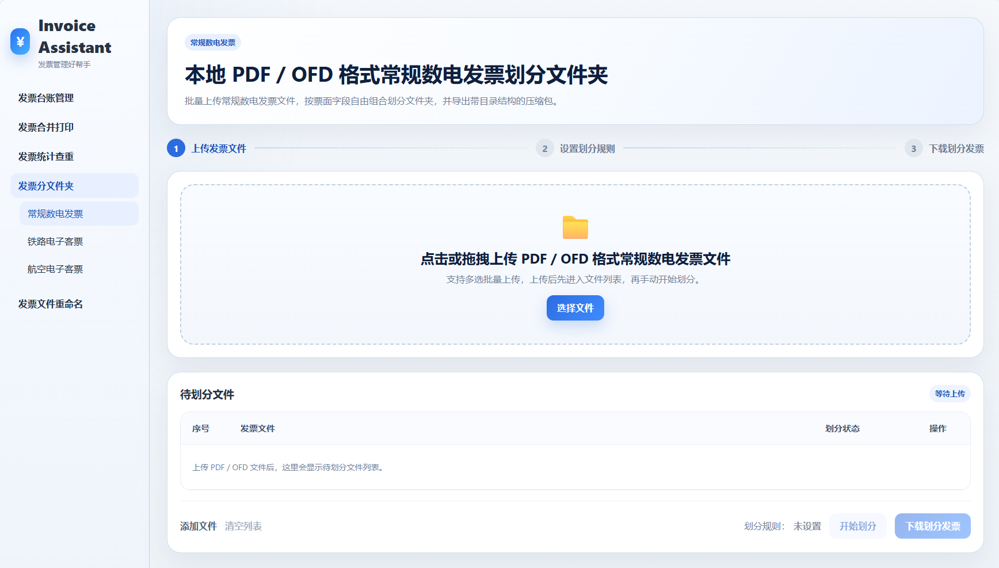
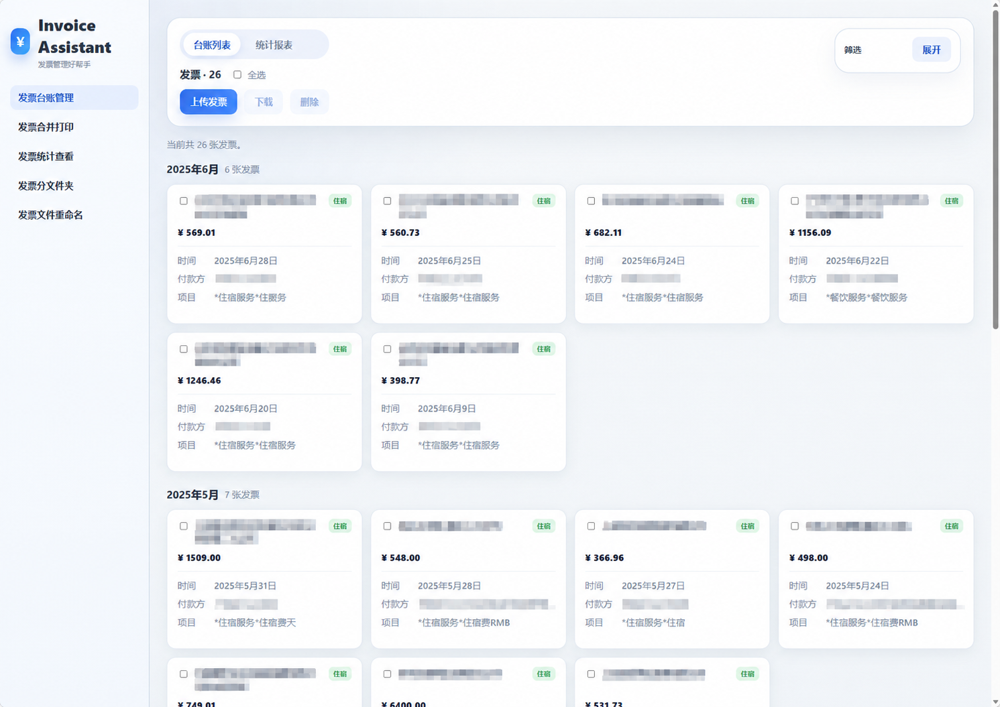
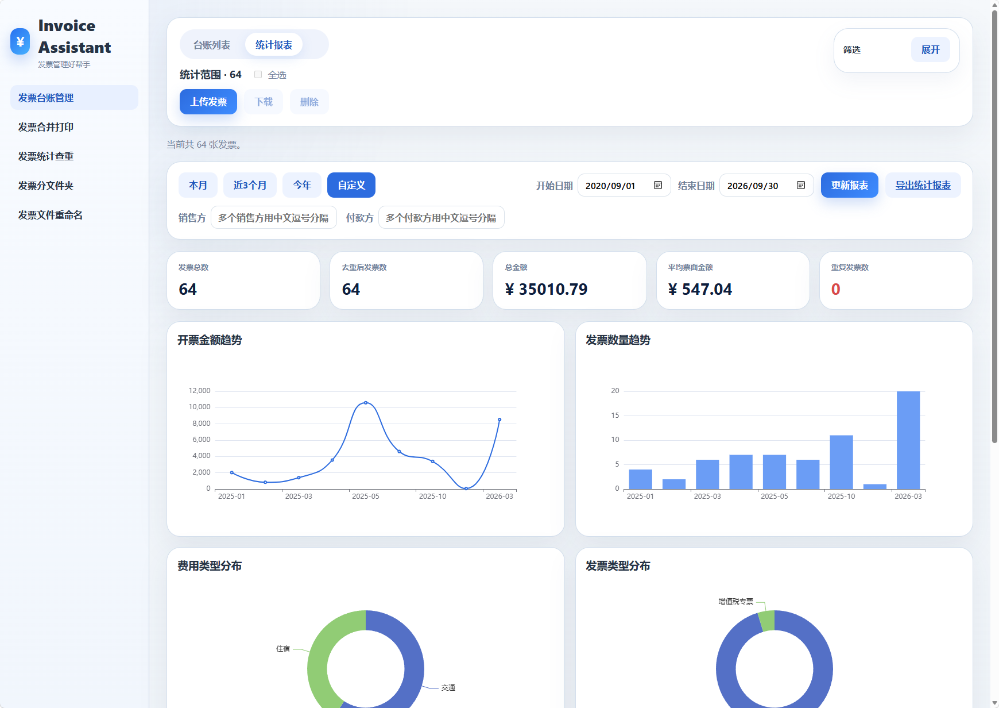
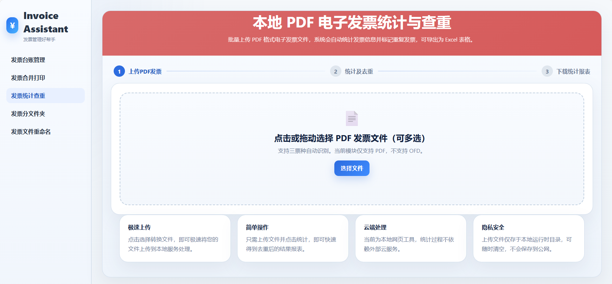
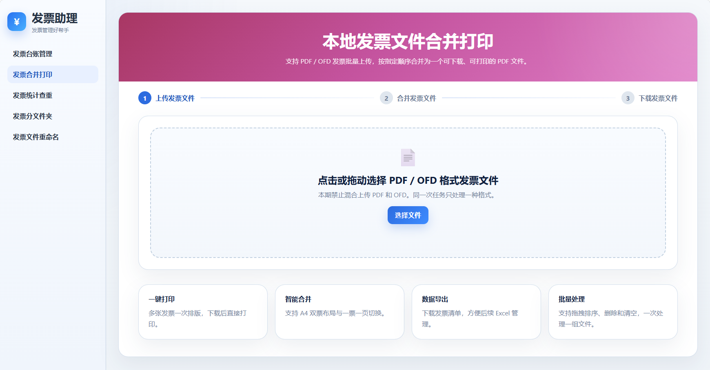

# Invoice Assistant - 发票自动化管理工作台

[概述](#-概述) · [架构](#-架构) · [功能概述](#-功能概述) · [快速开始](#-快速开始) · [适用边界](#适用边界)

## 📌 概述

Invoice Assistant 是一个面向个人报销、行政及财务票据整理场景的本地工作台，通过统一的数据处理链路连接票据接入、票面解析、文件整理、台账管理、重复检测、统计分析与合并打印。

工作台围绕五类核心能力构建：

- **票据接入与解析**：接收 PDF / OFD / JPG / JPEG / PNG 文件，识别常规数电发票、铁路电子客票和航空电子客票，提取可复用的票面字段。
- **文件整理与批量输出**：按自定义规则重命名或分文件夹整理，处理重名后导出 ZIP，且不覆盖原文件。
- **发票台账管理**：将混合票据沉淀为可筛选、可预览、可下载和可删除的本地台账。
- **统计分析与重复检测**：提供金额与数量趋势、费用及票种分布、重复发票识别、明细定位和 Excel 报表。
- **合并打印与材料编排**：支持排序、A4 双票 / 一票一页、PDF / OFD 合并和打印清单导出。

## 🏗️ 架构

核心业务约束由服务端统一执行：解析失败会保留在批次结果中，文件名会经过安全字符处理和冲突消解，导出流程只读取已成功解析的记录。电子 PDF / OFD 优先采用 Native Parser，图片及扫描 PDF 在需要时自动使用 PP-OCRv5 OCR Fallback；解析结果会标记为“原生解析”或“OCR识别”。当前任务状态保存在进程内，台账记录保存在 SQLite，因此项目定位为本地单用户工作台。



## 🧩 功能概述

### 票据接入与解析｜三类票据统一处理

**核心机制：** 按票种拆分解析器，同时使用统一的数据模型和重命名规则配置，降低不同票面版式对上层流程的影响。

**处理流程：** `上传 PDF / OFD / 图片 → Native Parser 优先 → OCR Fallback → 自动识别票种 → 提取字段 → 保留解析状态 → 交给整理、台账或统计流程`

**异常分支：** 不支持的扩展名、无法提取文本或无法识别票种的文件会标记为失败并保留错误信息，不阻断同一批次的其他文件。

**工程亮点：** 三类解析器共享统一数据模型，解析结果可被重命名、分文件夹、台账和查重流程复用。



### 文件整理与批量输出｜重命名、分文件夹与 ZIP 导出

**核心机制：** 将“生成目标名称”和“生成目标路径”拆开处理，允许按票面字段建立文件夹层级，并在导出前完整预览结果。

**处理流程：** `选择票种 → 配置规则 → 预览文件名 / 路径 → 处理重名 → 导出 ZIP`

**异常分支：** 空规则、非法路径字符和重复目标路径会被清理或追加后缀；失败文件不会进入成功导出集合。

**工程亮点：** 统一的规则配置服务于三种票据，导出结果保留目录结构；Excel 输出则由台账和统计模块按数据场景提供。


### 发票台账｜从文件整理到可查询记录

**核心机制：** 上传时自动识别票种并提取摘要，将原始文件路径、票面字段、解析状态和创建时间写入 SQLite 台账。

**管理流程：** `混合上传 → 解析入账 → 条件筛选 → 详情与原票预览 → 单张 / 批量下载或删除`

**异常分支：** 无法识别的文件会进入失败列表；原文件不存在或记录不存在时，接口返回明确错误，不生成无效下载。

**工程亮点：** 台账列表、详情、原票预览和批量下载共享同一份持久化记录，为后续统计和重复检测提供可追溯数据源。



### 统计分析与重复检测｜从汇总指标回溯明细

**核心机制：** 以发票号码优先、票种和关键字段组合兜底构建查重键，统一计算数量、金额、趋势、分布和重复明细。

**分析流程：** `筛选日期 / 票种 → 汇总指标与图表 → 定位重复组 → 导出 Excel 明细`

**异常分支：** 解析失败记录不参与统计，但会保留在结果中并展示失败原因，避免静默丢失输入文件。

**工程亮点：** 统计口径集中在服务端计算，指标卡、图表、重复明细和 Excel 导出共享相同过滤条件，减少前后端口径不一致。





### 合并打印｜面向报销材料的版式编排

**核心机制：** 对同一批次的 PDF 或 OFD 文件进行统一排序、分页和版式编排，支持 A4 双票或一票一页。

**处理流程：** `上传 → 拖拽排序 → 选择版式 → 预览 → 下载合并 PDF / 导出清单`

**异常分支：** 同一任务不允许混合 PDF 和 OFD；空任务、无效顺序或缺失产物会被拒绝并返回提示。

**工程亮点：** 合并结果与清单导出使用同一排序结果，便于打印件和明细逐项核对。



### 工作台级工程能力

- **分层解析**：票种解析器负责字段提取，上层流程负责任务、规则与导出。
- **批次级容错**：单文件失败不会阻断同批次成功文件。
- **原文件保护**：上传文件进入本地运行目录，导出生成新文件，不直接覆盖输入。
- **持久化台账**：SQLite 保存台账记录，支持筛选、预览、统计和批量下载。
- **可验证交付**：测试覆盖三类解析器、规则处理、台账、统计查重、合并打印和主要 API 流程。

## 🚀 快速开始

运行环境：Python 3.11 或 3.12（OCR 依赖建议使用已验证的独立虚拟环境）。项目默认仅监听本机 `127.0.0.1:5050`，不提供公网部署。

默认单次请求体上限为 50 MB；仅在本地调试时可设置 `INVOICE_ASSISTANT_DEBUG=1` 开启 Flask 调试模式。

```powershell
# 进入仓库根目录
Set-Location <仓库路径>

# 创建并启用虚拟环境（推荐）
python -m venv .venv
.\.venv\Scripts\Activate.ps1

# 安装运行依赖
python -m pip install -r requirements.txt

# 可选：启用 JPG/JPEG/PNG 和扫描 PDF 的 PP-OCRv5 OCR
python -m pip install -r requirements-ocr.txt

# 启动本地工作台
python app.py
```

浏览器访问 `http://127.0.0.1:5050`。

运行测试：

```powershell
python -m pip install -r requirements-dev.txt
python -m pytest -q
```

## 适用边界

- 面向本地单用户报销材料整理，不是多租户或公网 SaaS。
- 支持 PDF / OFD / JPG / JPEG / PNG 票据接入。电子 PDF / OFD 优先采用原生文本解析，图片及扫描 PDF 自动使用 PP-OCRv5 OCR 识别，并统一进入现有票种识别和字段解析流程。
- OCR 是可选能力；未安装 OCR 依赖不影响电子 PDF / OFD 的原生解析。当前 OCR 使用 PP-OCRv5，不包含 LLM、VLM、Agent 或在线 OCR 服务。
- 解析规则针对当前覆盖的常见票面版式，遇到新版本式需要补充解析规则和测试样例。
- OCR 在本地 CPU 环境运行，不依赖 LLM、VLM、Agent 或在线 OCR 服务。
